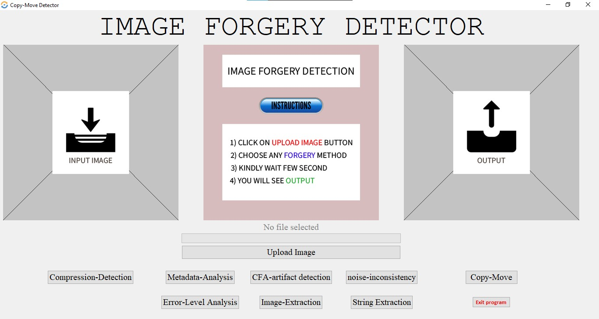

# Image Forgery Detection using Machine Learning and CNN

## Overview
This project aims to detect image forgeries using machine learning techniques and Convolutional Neural Networks (CNN). With the increasing use of digital images in various domains, the detection of tampered images has become crucial. This project leverages deep learning to identify and classify images as either authentic or tampered.

## Features
- Image Preprocessing: Techniques such as resizing, normalization, and data augmentation to prepare the image data.
- Feature Extraction: Utilizing CNNs to automatically extract features from images.
- Model Training: Employing deep learning algorithms, particularly CNNs, to train the model on image data.
- Evaluation Metrics: Assessing the model's performance using metrics like accuracy, precision, recall, and F1 score.
  
## Technologies Used
- Python
- Deep Learning Libraries (e.g., TensorFlow, Keras)
- Machine Learning Algorithms (e.g., Convolutional Neural Networks)
